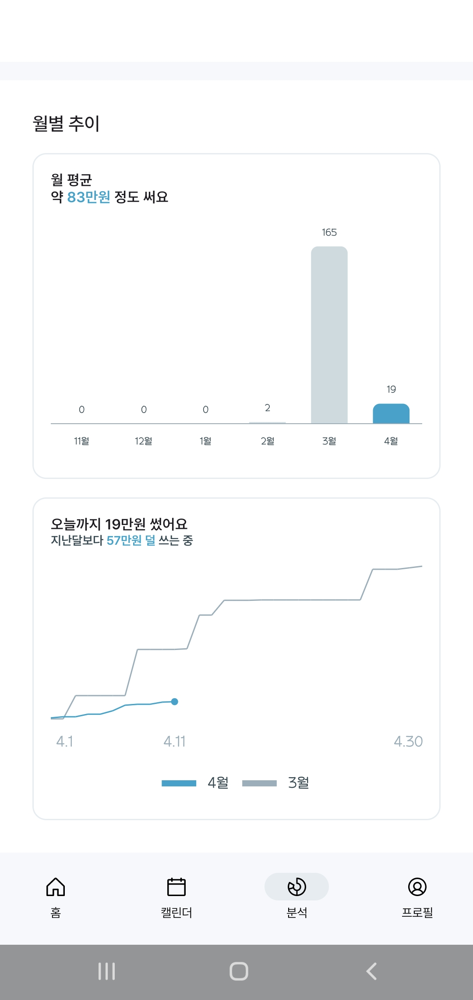

# 💰 물가 – 알림 기반 스마트 소비 추적 서비스

> 수동 입력 없이도  
> **금융 알림만으로 소비를 자동 기록하고 시각화**하는 가계부 서비스

---

## 📌 프로젝트 개요

‘물가’는 카드사 및 간편결제 앱에서 수신한 금융 알림 메시지를 자동으로 수집하고, 이를 구조화하여 사용자 소비 내역으로 저장하는 **Android 기반 가계부 앱**입니다.  
알림 데이터를 바탕으로 지출을 자동 기록하고, 월별 리포트 형태로 시각화하여 제공함으로써, 사용자가 별도 입력 없이 자신의 소비 흐름을 자연스럽게 파악할 수 있도록 설계되었습니다.

---

## 💡 기획 배경

기존의 가계부 앱은 수기 입력에 대한 부담이 크거나, 마이데이터 연동에 의존해 **페이 결제**와 같은 일부 소비 내역이 누락되는 한계가 있었습니다.  
이러한 문제를 해결하고자, 우리는 사용자의 스마트폰에 도착하는 **금융 알림 자체를 데이터 소스**로 활용하는 방식에 주목했습니다.  
이를 통해 사용자 개입을 최소화하면서도 더 정교하게 소비 내역을 자동 수집하고, 일관된 구조로 기록하는 흐름을 설계하고자 했습니다.

---

## 🖼 화면 미리보기

### 0. 온보딩 & 초기 설정

| 회원가입 화면 | 예산 설정 |
|:-----------:|:----------:|
|  |  

### 1. 메인 화면

| 메인화면 | 메인 화면(예산 초과) |
|:----------:|:------------------:|
|  |  |

### 2. 소비 내역 조회

| 달력형 | 목록형 |
|:----------:|:------------------:|
|  |  

### 3. 내역 추가 및 수정

| 지출 추가 | 수입 추가 | 내역 수정 | 카테고리 변경 |
|:----------:|:------------------:|:----------:|:------------------:|
|  |  |  |  |

### 4. 소비 분석 리포트

| 월별 소비 비율 | 월별 추이 | 지출 수단 분석 | 월별 상세 |
|:----------:|:------------------:|:----------:|:------------------:|
|  |  |  |   |

### 5. 내역 병합 기능

| 내역 선택 및 병합 |병합 상세 내역 |
|:---------------:|:----------------:|
|  |  |

---

## ⚙️ 기술 스택

| 구성 | 기술 |
|------|------|
| 👨‍💻 Frontend(AOS) | Kotlin, Jetpack Compose, Retrofit, Room, Firebase Auth |
| 💾 Backend | Spring Boot 3.4.3, MongoDB, RabbitMQ, Firebase Admin |
| 🤖 AI | OpenAI ChatGPT API|
| 🔧 DevOps | Docker, Jenkins|

### 🧱 아키텍처 다이어그램

| 전체 구조 |
|:----------:|
|  |

---

### 팀원 소개
<table width=“800”>
  <tr align=center>
    <td></td>
    <td></td>
    <td></td>
  </tr>
  <tr align=center>
    <td><A href="https://github.com/l3olvy">김본</A></td>
    <td><A href="https://github.com/taehanyoon">윤태한</A></td>
    <td><A href="https://github.com/gggwww06">윤혜진</A></td>
  </tr>
  <tr align=center>
    <td>FE(AOS)</td>
    <td>FE(AOS), Infra</td>
    <td>FE(AOS)</td>
  </tr>
  <tr align=center>
    <td></td>
    <td></td>
    <td></td>
  </tr>
  <tr align=center>
    <td><A href="https://github.com/KyuliLee">이규리</A></td>
    <td><A href="https://github.com/spig0126">정연희</A></td>
    <td><A href="https://github.com/jeong-hyeonHwang">황정현</A></td>
  </tr>
  <tr align=center>
    <td>BE, Infra</td>
    <td>BE</td>
    <td>FE(AOS)</td>
  </tr>
</table>

 
