# 시연 시나리오(제출용)

상태: 완료
영역: 시연 시나리오

## `물가` 시연 시나리오

### 로그인 / 회원가입

---

1. 로그인/회원가입 진입 화면

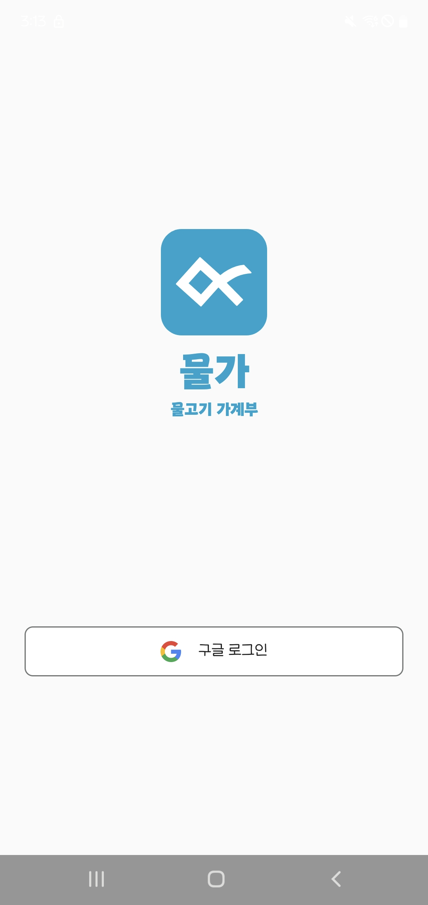

1. 한 달 사용 예산 설정 화면 (신규 회원)

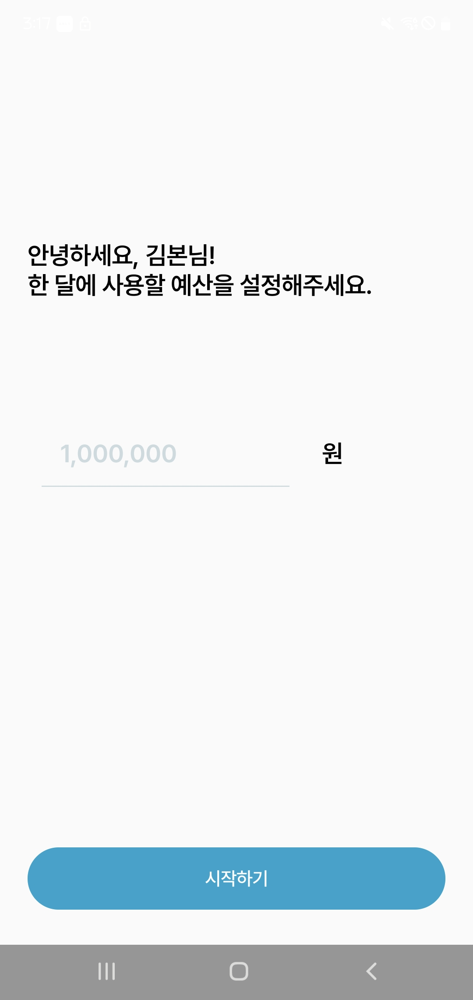

### 메인 화면

---

1. 예산 초과 X

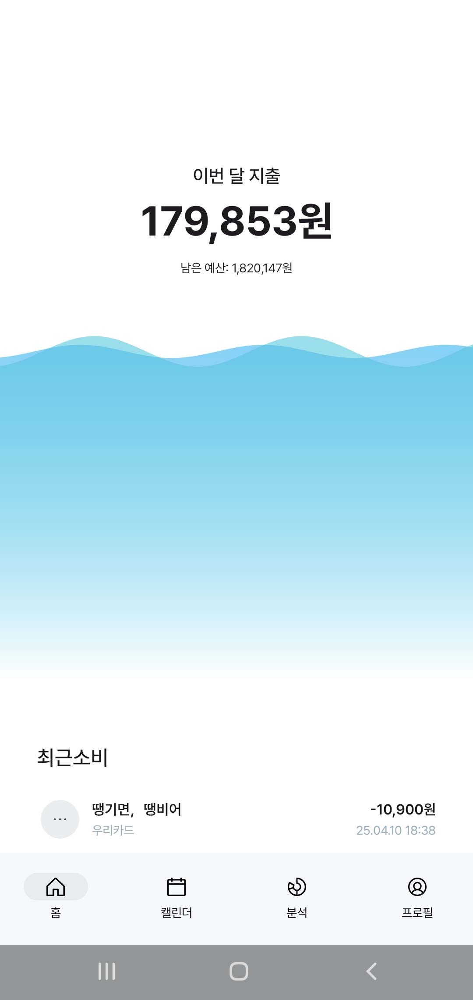

1. 예산 초과 O

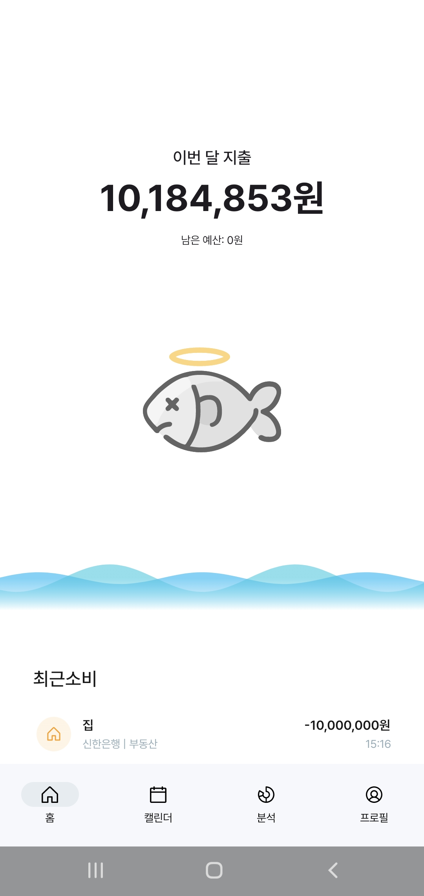

### 캘린더/리스트 상세 내역

---

1. 캘린더뷰

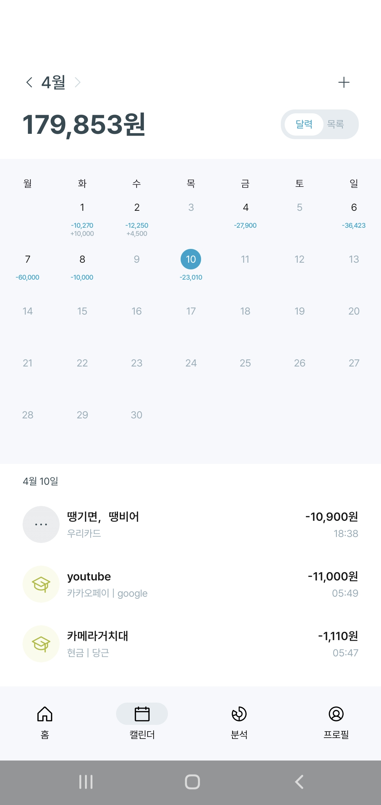

1. 리스트뷰

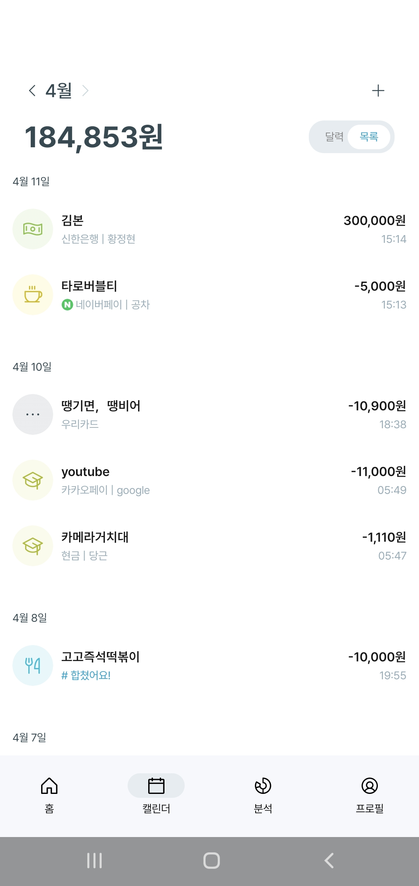

1. 연관된 거래 내역 합치기

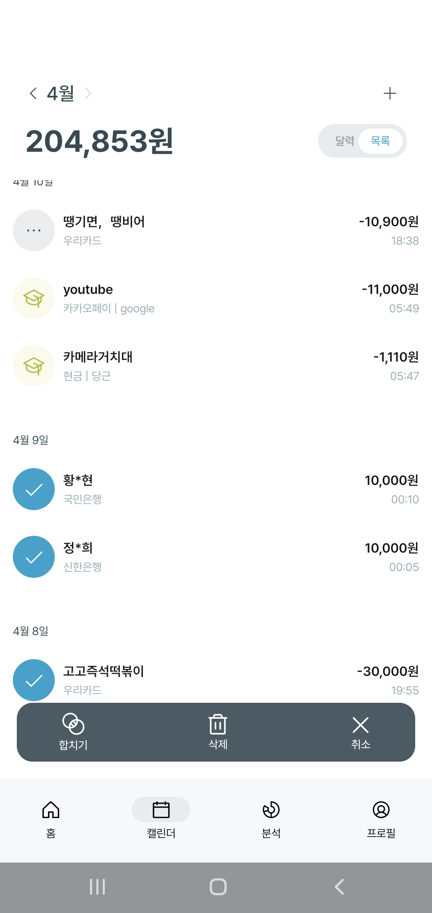

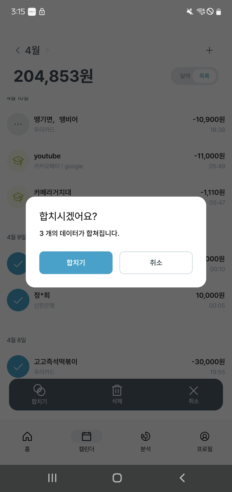

1. 합친 내역 조회

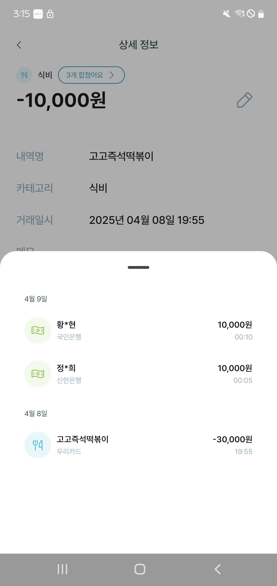

1. 합친 내역 수정

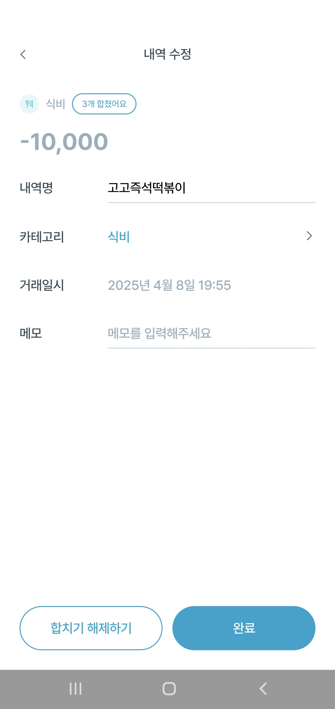

1. 합친 내역 삭제

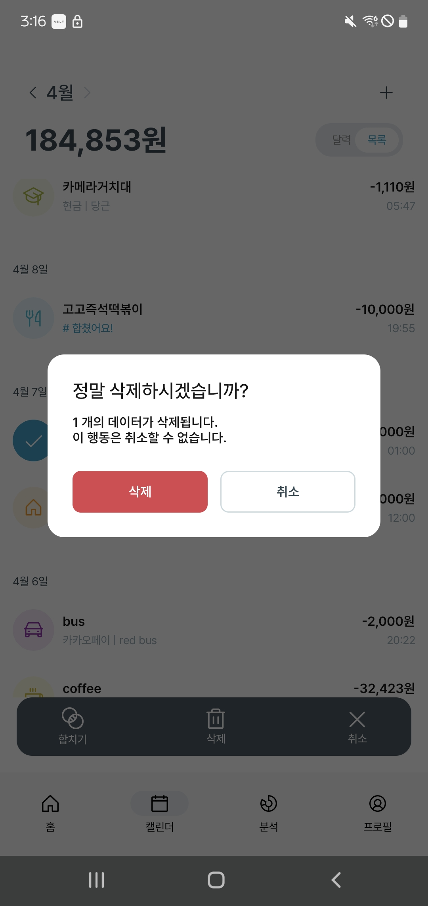

1. 내역 추가

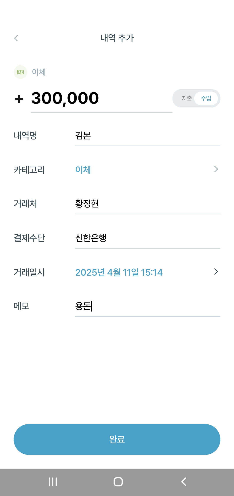

1. 내역 수정

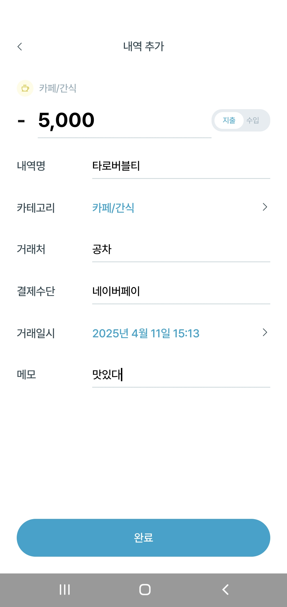

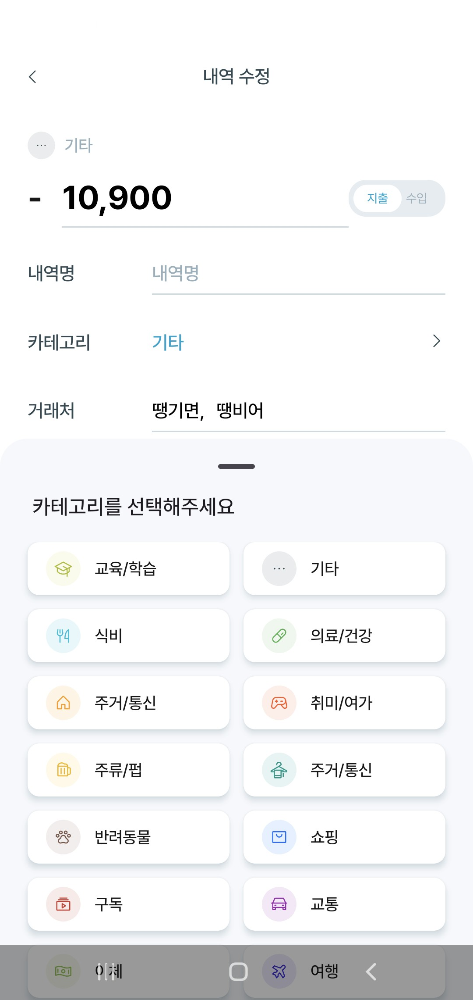

### 분석 페이지

---

1. 카테고리 차트

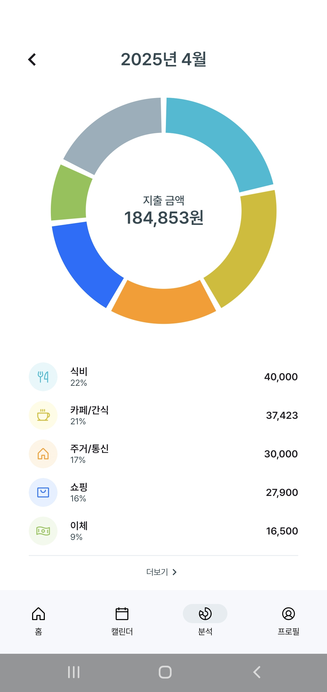

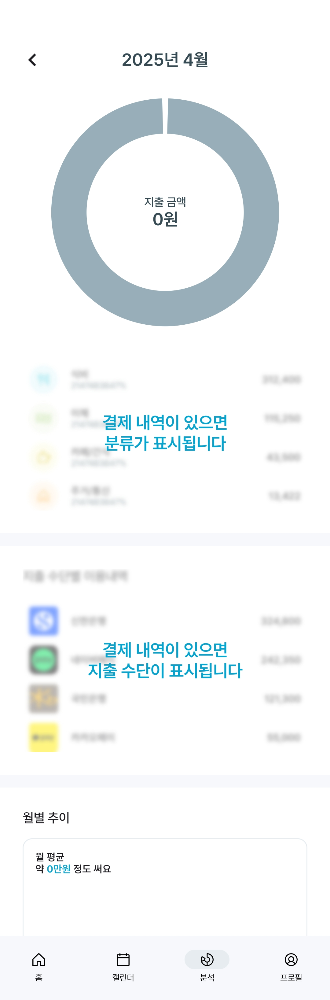

1. 카테고리 차트 상세 페이지

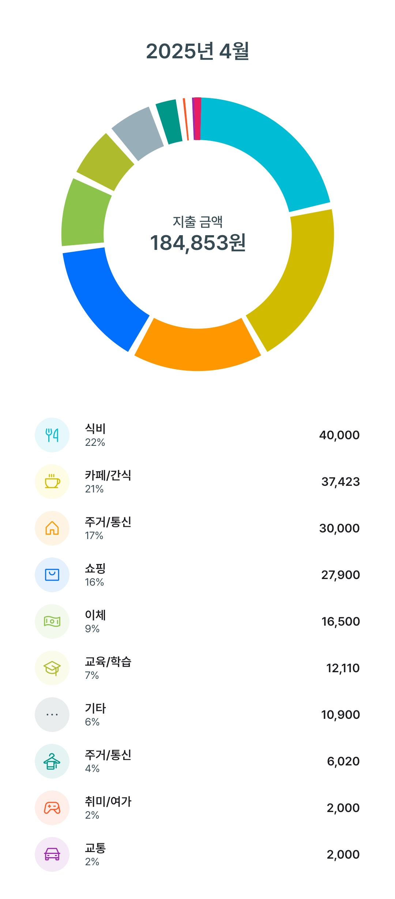

1. 지출 수단별 이용내역

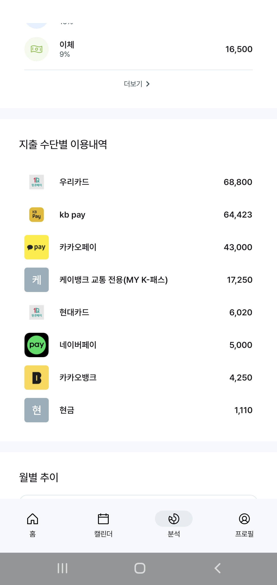

1. 월별 추이

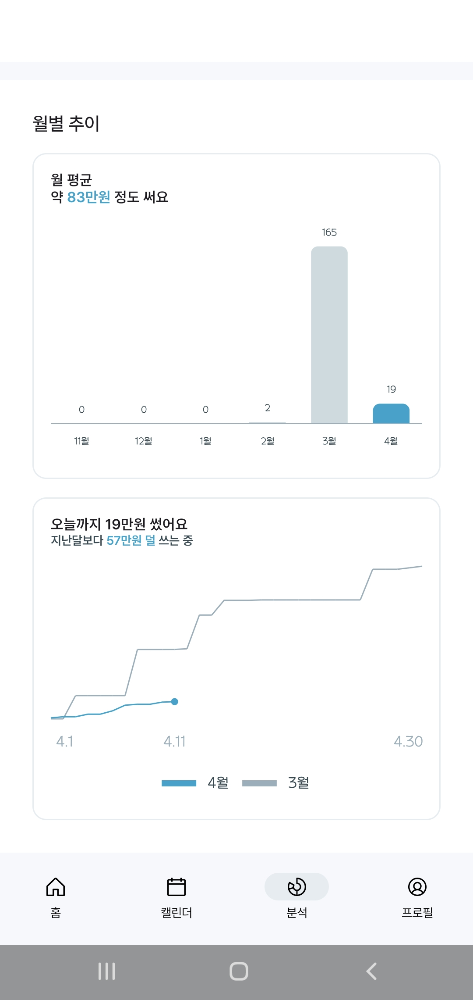

### 프로필 페이지

---

1. 프로필 페이지

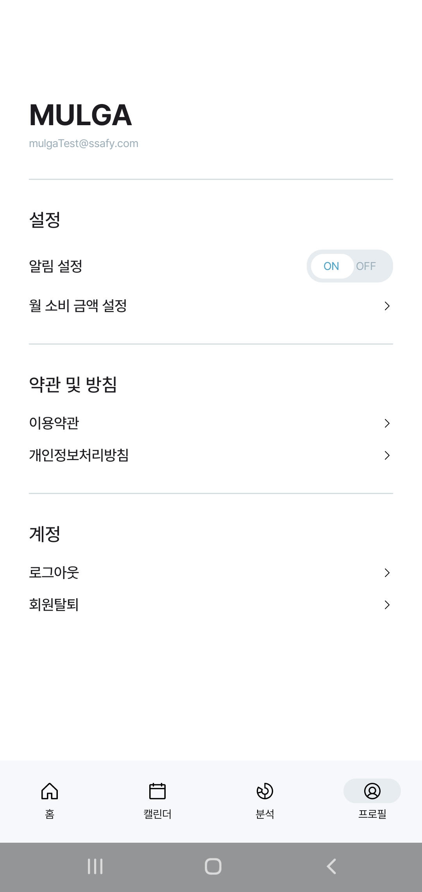

1. 로그아웃

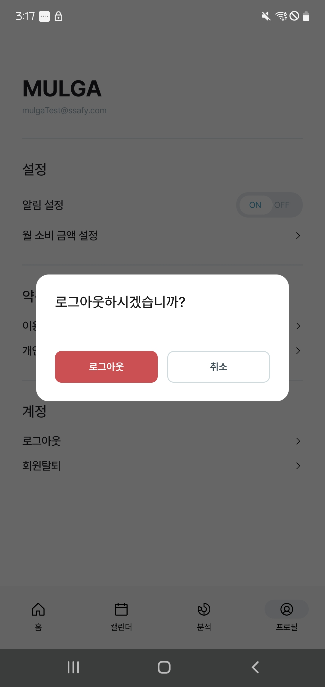